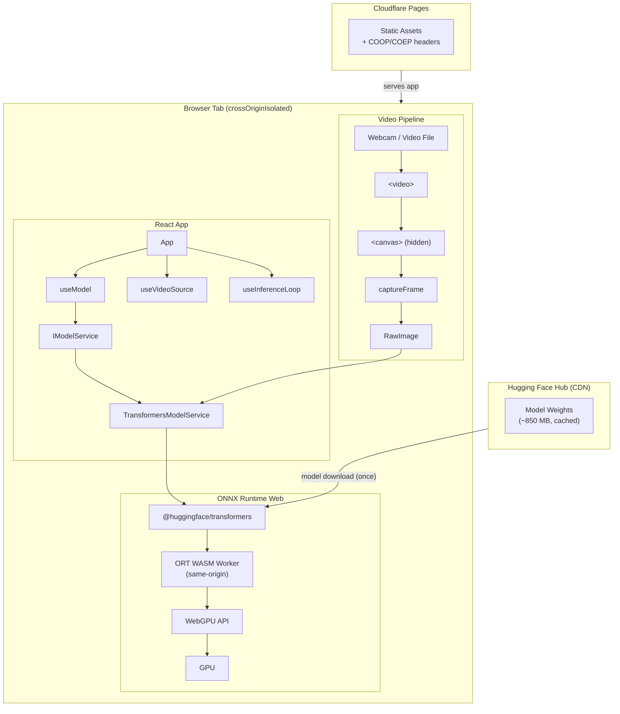
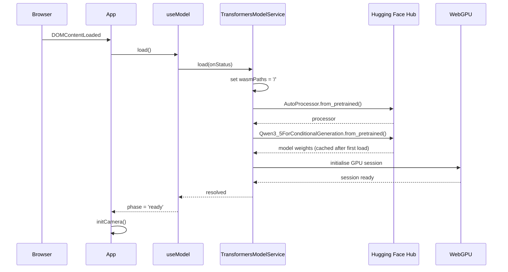
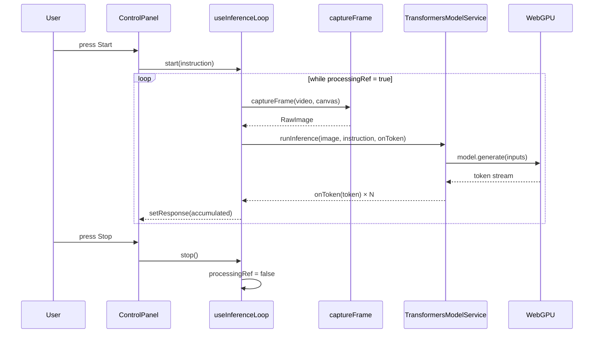
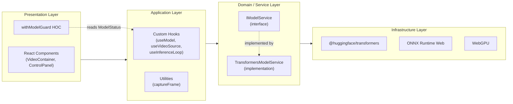

# Architecture

## Overview

Qwen3.5-0.8B WebGPU is a fully client-side vision-language inference application. There is no backend service. The model, the runtime, and all computation live in the browser tab.

The architecture is shaped by three hard constraints:

1. **WebGPU requires `crossOriginIsolated`** — the browser will only expose `SharedArrayBuffer` (needed by ONNX Runtime's GPU backend) when the page is served with `Cross-Origin-Opener-Policy: same-origin` and `Cross-Origin-Embedder-Policy: credentialless`.
2. **COEP blocks cross-origin workers** — ONNX Runtime spawns Web Workers to run WASM. Under COEP, those worker scripts must be same-origin. We copy them from `node_modules` to `public/` at build time and point the runtime at `/`.
3. **The model is large (~850 MB)** — it is never bundled. It is fetched from Hugging Face Hub at runtime and cached by the browser's Cache API on first load.

---

## System diagram

---

## Runtime initialization sequence

---

## Inference loop sequence

---

## Layered architecture

The dependency arrows flow strictly downward. The Presentation layer never imports from Infrastructure directly. The Domain layer defines an interface (`IModelService`) that decouples the application layer from any specific ML library.

---

## SOLID principles applied

### Single Responsibility

Each module has one reason to change:

| Module | Responsibility |
|---|---|
| `useModel` | Model lifecycle (load, status) |
| `useVideoSource` | Media stream lifecycle |
| `useInferenceLoop` | Capture-infer-stream loop |
| `captureFrame` | Frame extraction from `<video>` |
| `TransformersModelService` | HuggingFace/ONNX integration |

### Open / Closed

`IModelService` is the extension point. To swap in a different model or runtime (e.g. WebLLM, GGUF via Wasm), implement `IModelService` and inject the new class. No UI code changes.

### Liskov Substitution

Any `IModelService` implementation can replace `TransformersModelService` transparently. The hooks and components only depend on the interface contract.

### Interface Segregation

`IModelService` exposes exactly three methods — no more. Components receive only the props they use; no "god objects" are passed down the tree.

### Dependency Inversion

`useModel` holds a `ref` typed as `IModelService`. The concrete `TransformersModelService` is injected at the call site. The hook never imports the implementation directly — only the interface type.
