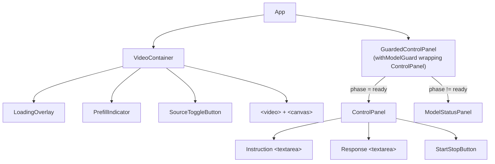
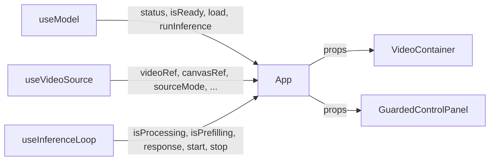
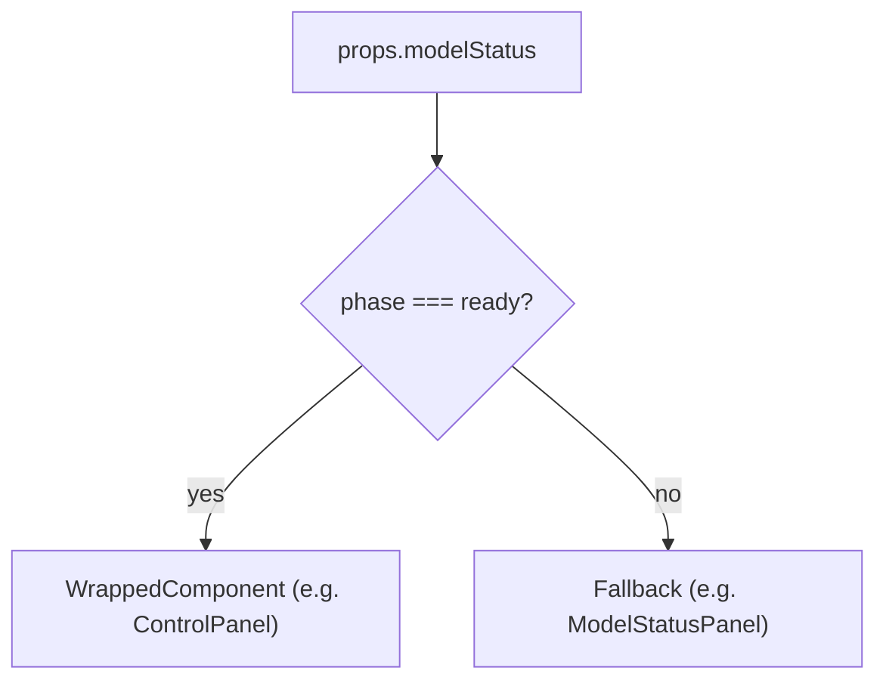

# Components

## Component tree



---

## App

**File:** `src/App.tsx`

The root component. It owns no visual layout beyond the outer `<main>` wrapper — its job is composition and wiring.

Responsibilities:
- Instantiates the three top-level hooks (`useModel`, `useVideoSource`, `useInferenceLoop`)
- Checks for `navigator.gpu` and renders `<NoWebGPU>` if WebGPU is unavailable
- Triggers model loading and camera initialisation on mount
- Passes derived state and callbacks down to child components



---

## withModelGuard (HOC)

**File:** `src/hoc/withModelGuard.tsx`

A generic Higher-Order Component that gates the rendering of any wrapped component behind model readiness. While the model is loading or in error, a fallback component is rendered instead.



Usage:

```typescript
const GuardedControlPanel = withModelGuard(ControlPanel, ModelStatusPanel)
// <GuardedControlPanel modelStatus={status} ...controlPanelProps />
```

The HOC sets `displayName` for React DevTools — `withModelGuard(ControlPanel)` — making the guard visible in the component tree.

---

## VideoContainer

**File:** `src/components/VideoContainer/index.tsx`

Renders the video feed and all overlays. The `<video>` and hidden `<canvas>` elements are passed in as refs from `useVideoSource`, so this component never owns media stream state.

| Prop | Type | Purpose |
|---|---|---|
| `videoRef` | `RefObject<HTMLVideoElement>` | Live video element |
| `canvasRef` | `RefObject<HTMLCanvasElement>` | Hidden capture canvas |
| `sourceMode` | `'webcam' \| 'file'` | Controls overlay button label |
| `isModelLoading` | `boolean` | Shows `LoadingOverlay` |
| `modelLoadingMessage` | `string` | Status text inside overlay |
| `isPrefilling` | `boolean` | Shows `PrefillIndicator` |
| `isProcessing` | `boolean` | Dims video during processing |
| `onSourceToggle` | `() => void` | Switches back to webcam |
| `onFileSelected` | `(file: File) => void` | Loads a video file |

### LoadingOverlay

Displayed while `isModelLoading` is true. Shows a spinner and the current loading status message (e.g. "Loading processor...", "Loading model (~850 MB)...").

### PrefillIndicator

A subtle spinner shown while `isPrefilling` is true — the period between frame capture and the first token arriving. It communicates that the vision encoder is running.

### SourceToggleButton

Renders as "Use webcam" when source mode is `'file'`, and hides when already in webcam mode. Triggers `onSourceToggle` on click. Accepts file drops (hidden `<input type="file">`) to trigger `onFileSelected`.

---

## ControlPanel

**File:** `src/components/ControlPanel/index.tsx`

Rendered only when the model is ready (via `withModelGuard`). Contains the user's instruction input and the model's streaming response output.

| Prop | Type | Purpose |
|---|---|---|
| `isProcessing` | `boolean` | Disables instruction input, toggles button |
| `canStart` | `boolean` | Guards Start button (model ready + active input) |
| `response` | `string` | Accumulated model output |
| `onStart` | `(instruction: string) => void` | Begins the inference loop |
| `onStop` | `() => void` | Signals loop to stop |
| `onInstructionChange` | `(instruction: string) => void` | Live-updates the instruction ref |

### StartStopButton

**File:** `src/components/StartStopButton.tsx`

A single button that renders green ("Start") or red ("Stop") based on `isProcessing`. Disabled when `canStart` is false (model not ready or no active input).
