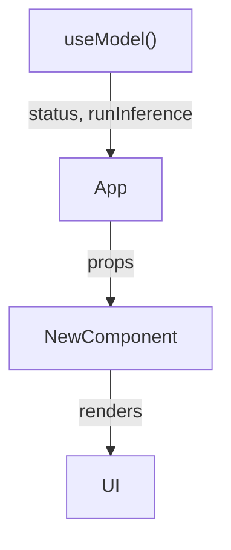

# Contributing

## Getting started

```bash
git clone git@github.com:kinncj/Qwen3.5-0.8B-WebGPU.git
cd Qwen3.5-0.8B-WebGPU
npm install
npm run dev
```

Open `http://localhost:5173` in Chrome 113+. The first run downloads ~850 MB of model weights; subsequent runs load from browser cache.

---

## Project conventions

### TypeScript

- Strict mode is enabled. No `any` except at the boundary with `@huggingface/transformers` (whose types are incomplete for newer model classes). Annotate `any` usage with `// eslint-disable-next-line @typescript-eslint/no-explicit-any`.
- Prefer `type` imports (`import type { Foo }`) for type-only imports.
- Keep types close to where they are used. Shared types live in `src/types/index.ts`.

### React

- Functional components only. No class components.
- State that drives rendering lives in `useState`. State that does not drive rendering lives in `useRef`.
- Stable callback references via `useCallback`. Avoid recreating callbacks on every render.
- Components accept only the props they use. Do not pass "god objects" or entire hook returns.

### File naming

- Component files: `PascalCase.tsx` or `PascalCase/index.tsx` for folders.
- Hook files: `camelCase.ts`, prefixed with `use`.
- Service files: `PascalCase.ts`.
- Interface files: `IPascalCase.ts`.
- Utility files: `camelCase.ts`.

---

## SOLID principles — a practical guide for this codebase

### Adding a new model or backend

1. Create a new file in `src/services/`, e.g. `WebLLMModelService.ts`.
2. Implement `IModelService`:

```typescript
import type { IModelService } from './IModelService'
import type { RawImage } from '@huggingface/transformers'

export class WebLLMModelService implements IModelService {
  async load(onStatus: (msg: string) => void): Promise<void> {
    // ...
  }
  async runInference(image: RawImage, instruction: string, onToken: (token: string) => void): Promise<void> {
    // ...
  }
  isReady(): boolean { return this.ready }
}
```

3. In `useModel.ts`, swap the concrete class:

```typescript
const serviceRef = useRef<IModelService>(new WebLLMModelService())
```

No other files change.

### Adding a new UI component

Components receive props; they do not call hooks or access global state directly. If a component needs data from a hook, the hook result is threaded through props by the parent.



### Adding a new hook

A hook should own one concern. If you find yourself passing the result of one hook into another hook's arguments, that is acceptable — compose in `App`, not inside hooks.

---

## Testing

There are no automated tests yet. Manual testing checklist for any PR:

- [ ] `npm run build` completes without TypeScript errors
- [ ] App loads in Chrome 113+ without console errors
- [ ] Model loads successfully (status reaches "Ready")
- [ ] Webcam feed starts automatically after model load
- [ ] Start button begins the inference loop
- [ ] Response streams token by token
- [ ] Stop button halts the loop cleanly
- [ ] Switching to a video file and back to webcam works
- [ ] `crossOriginIsolated` is `true` in production (`console.log(crossOriginIsolated)`)

---

## Pull requests

- Keep PRs focused. One concern per PR.
- The commit message should describe _why_, not _what_.
- Do not include "Co-Authored-By" or AI attribution lines.
- Run `npm run build` locally before opening a PR — the CI will catch type errors but it is faster to catch them yourself.

---

## License

This project is licensed under the GNU Affero General Public License v3.0 (AGPL-3.0). By contributing, you agree that your contributions will be licensed under the same terms.

Key implications of AGPL-3.0:
- Anyone who runs a modified version of this software over a network must make the modified source available.
- Derivative works must also be licensed under AGPL-3.0.
- Attribution must be preserved.
