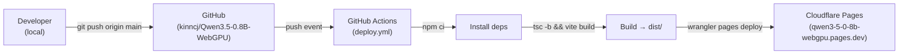
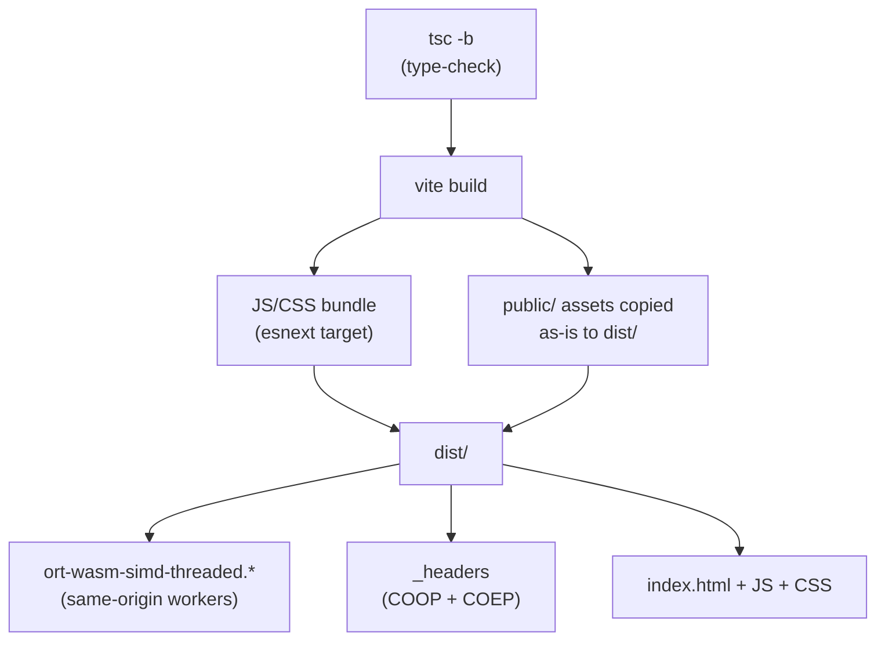

# Deployment

## Overview

The app is a fully static site — no server-side rendering, no API routes, no edge functions. After `npm run build`, the `dist/` directory contains everything needed to serve the application.

Hosting is on **Cloudflare Pages**, which serves the static assets and applies custom HTTP headers via `public/_headers`. The CI/CD pipeline is GitHub Actions.

---

## Pipeline



---

## GitHub Actions workflow

**File:** `.github/workflows/deploy.yml`

Triggers on every push to `main`. Steps:

1. `actions/checkout@v4` — check out the commit
2. `actions/setup-node@v4` — Node 22 with `npm` cache
3. `npm ci` — deterministic install from `package-lock.json`
4. `npm run build` — TypeScript check + Vite bundle → `dist/`
5. `cloudflare/pages-action@v1` — deploy `dist/` to Cloudflare Pages

### Required GitHub secrets

| Secret | Where to find it |
|---|---|
| `CLOUDFLARE_API_TOKEN` | Cloudflare dashboard → My Profile → API Tokens → Create Token (Pages: Edit) |
| `CLOUDFLARE_ACCOUNT_ID` | Cloudflare dashboard → sidebar (any page) |

---

## Build process



Key build configuration:

```typescript
// vite.config.ts
export default defineConfig({
  plugins: [react()],
  optimizeDeps: {
    exclude: ['@huggingface/transformers'],  // do not pre-bundle — it uses dynamic WASM imports
  },
  build: {
    target: 'esnext',  // required for top-level await used by the transformers library
  },
})
```

`@huggingface/transformers` is excluded from Vite's dependency pre-bundling because it uses dynamic `import()` for WASM and has internal workers that must not be inlined. Vite would otherwise try to bundle it into a single chunk, breaking the WASM loading paths.

---

## Cloudflare Pages configuration

The project name is `qwen3-5-0-8b-webgpu`. The production deployment URL is `https://qwen3-5-0-8b-webgpu.pages.dev`.

Cloudflare Pages serves the `_headers` file as HTTP response headers. There is no `wrangler.toml` — the project is purely static with no Workers, KV, D1, or other bindings.

### `public/_headers`

```
/*
  Cross-Origin-Opener-Policy: same-origin
  Cross-Origin-Embedder-Policy: credentialless
```

These headers are applied to every response, including the HTML entry point and all static assets. This ensures `crossOriginIsolated` is `true` in the browser, which is required for `SharedArrayBuffer` and therefore for the WebGPU ONNX backend.

---

## Local development

```bash
npm install
npm run dev         # Vite dev server on http://localhost:5173
npm run build       # Production build to dist/
npm run preview     # Serve dist/ locally (uses vite preview)
```

The Vite dev server satisfies the `localhost` requirement for webcam access. It does not inject COOP/COEP headers by default — if you need to test cross-origin isolation locally, add a Vite plugin or run `npm run preview` after setting the headers manually.

---

## Rollback

Cloudflare Pages preserves every deployment. To roll back:

1. Go to Cloudflare dashboard → Pages → `qwen3-5-0-8b-webgpu` → Deployments
2. Find the previous deployment
3. Click "Rollback to this deployment"

This is instant — no rebuild required.
