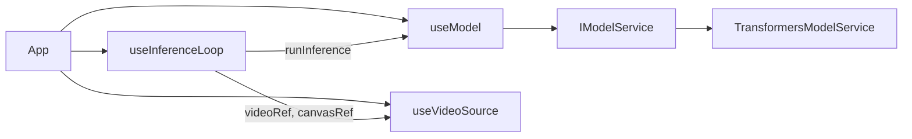
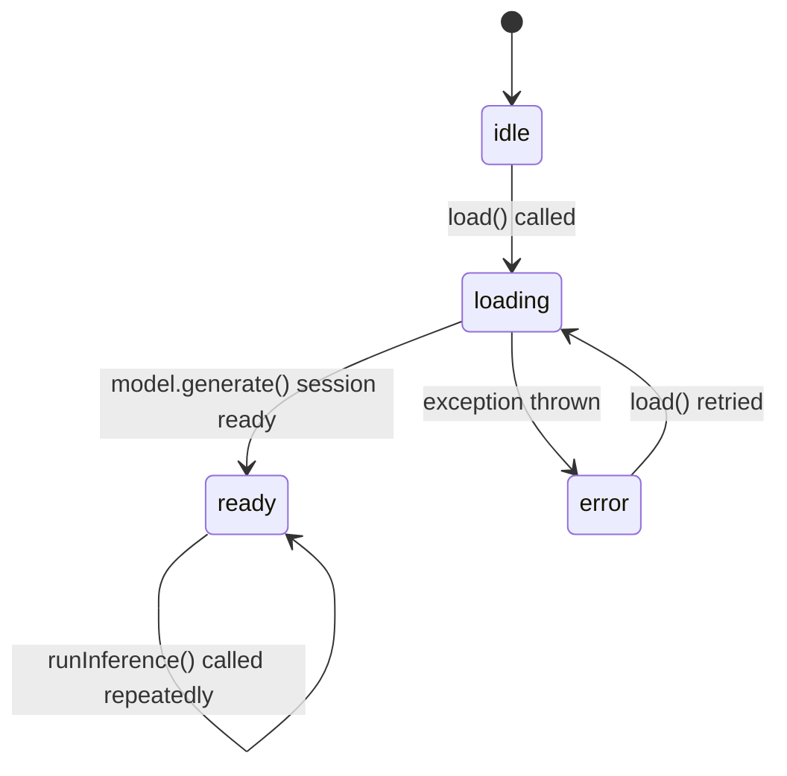
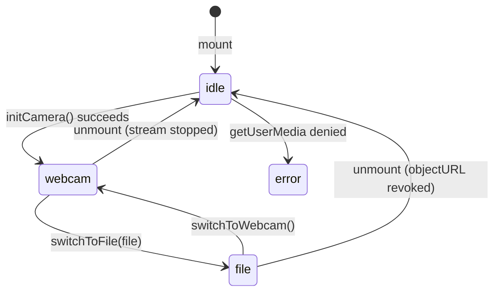
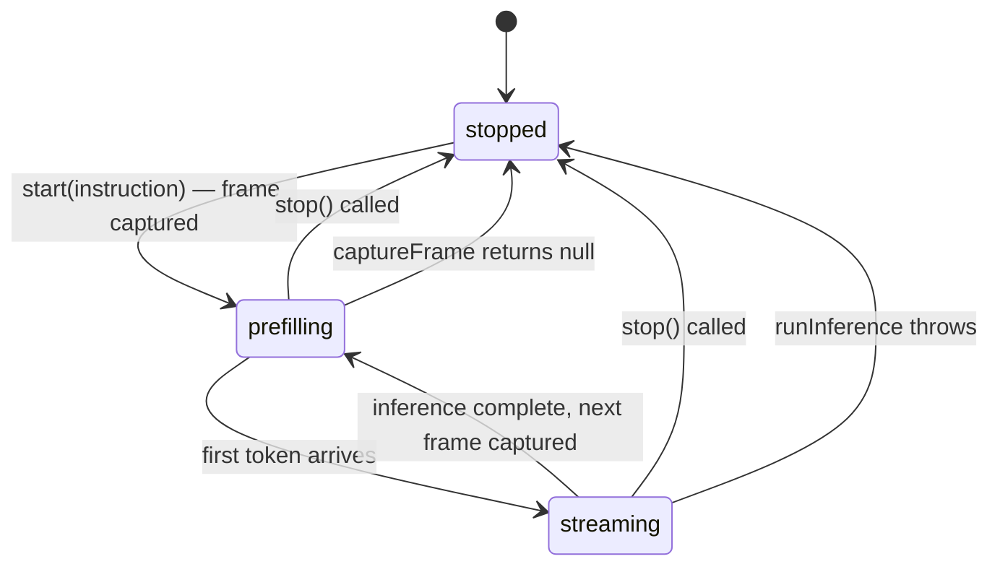

# Hooks

The application state is managed through three focused custom hooks. Each hook owns exactly one concern and exposes a minimal, typed API surface.

---

## Hook dependency map

`useInferenceLoop` receives `runInference` from `useModel` and `videoRef`/`canvasRef` from `useVideoSource`. The hooks themselves have no dependency on each other — composition happens in `App`.

---

## useModel

**File:** `src/hooks/useModel.ts`

Manages the full lifecycle of the ML model: loading, status reporting, and inference dispatch.

### State machine

### API

| Return value | Type | Description |
|---|---|---|
| `status` | `ModelStatus` | Current `{ phase, message }` |
| `isReady` | `boolean` | Shorthand: `status.phase === 'ready'` |
| `load` | `() => Promise<void>` | Triggers model download and GPU init |
| `runInference` | `(image, instruction, onToken) => Promise<void>` | Delegates to `IModelService` |

### Key design decisions

- **`serviceRef`** — The `IModelService` instance lives in a `useRef`, not `useState`. This prevents unnecessary re-renders when the service's internal state changes (e.g. weights being loaded). React only re-renders when `status` changes.
- **Stable callbacks** — Both `load` and `runInference` are wrapped in `useCallback` with empty dependency arrays. They are safe to pass to `useEffect` without triggering re-runs.
- **Error surfacing** — Errors during `load()` are caught, stored in `status`, and re-thrown so callers (e.g. `App`) can react without duplicating error-handling logic.

---

## useVideoSource

**File:** `src/hooks/useVideoSource.ts`

Manages the media source: webcam stream, file-based video, and transitions between the two.

### State machine

### API

| Return value | Type | Description |
|---|---|---|
| `videoRef` | `RefObject<HTMLVideoElement>` | The live `<video>` element ref |
| `canvasRef` | `RefObject<HTMLCanvasElement>` | The hidden capture `<canvas>` ref |
| `sourceMode` | `'webcam' \| 'file'` | Current source type |
| `hasActiveInput` | `boolean` | True once a stream or file is playing |
| `cameraError` | `string \| null` | Error message if `getUserMedia` was denied |
| `initCamera` | `() => Promise<boolean>` | Requests webcam access |
| `switchToFile` | `(file: File) => void` | Loads a local video file |
| `switchToWebcam` | `() => void` | Alias for `initCamera` |

### Key design decisions

- **Stream cleanup on unmount** — A `useEffect` cleanup stops all webcam tracks and revokes object URLs when the component unmounts, preventing media leaks.
- **`streamRef` vs state** — The `MediaStream` is stored in a `ref` rather than state. It never needs to trigger a render; only `sourceMode` and `hasActiveInput` drive UI updates.
- **Object URL lifecycle** — When switching from file to webcam, the previous object URL is revoked before creating a new stream, freeing the underlying file handle immediately.

---

## useInferenceLoop

**File:** `src/hooks/useInferenceLoop.ts`

Runs a continuous capture → infer → display loop. Manages the async loop lifecycle and token streaming into React state.

### State machine

### API

| Return value | Type | Description |
|---|---|---|
| `isProcessing` | `boolean` | True while the loop is running |
| `isPrefilling` | `boolean` | True while the vision encoder is running (no tokens yet) |
| `response` | `string` | Accumulated token output for the current frame |
| `start` | `(instruction: string) => void` | Starts the loop |
| `stop` | `() => void` | Signals the loop to stop after current inference |
| `updateInstruction` | `(instruction: string) => void` | Hot-updates the instruction without restarting |

### Key design decisions

- **`processingRef` as loop gate** — The loop condition checks `processingRef.current`, a `useRef`. Setting it to `false` in `stop()` terminates the loop after the current `await runInference()` resolves — no abrupt cancellation, no torn state.
- **`instructionRef` for hot updates** — The instruction is stored in a ref so that `updateInstruction` can change it mid-loop without restarting. The next iteration picks up the new value automatically.
- **Token accumulation** — The `onToken` callback resets the response on `firstToken = true` (start of each new inference) and appends on subsequent tokens. This gives a clean per-frame response with no leftover text from the previous frame.
- **`isPrefilling` signal** — The prefilling state is set to `true` immediately after frame capture and cleared on the first token. This gives the UI a hook to show a "processing image" spinner during the vision encoder pass, which is the slowest part of each inference.
