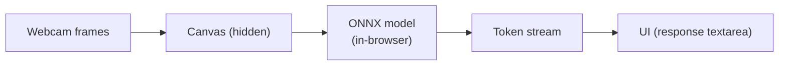
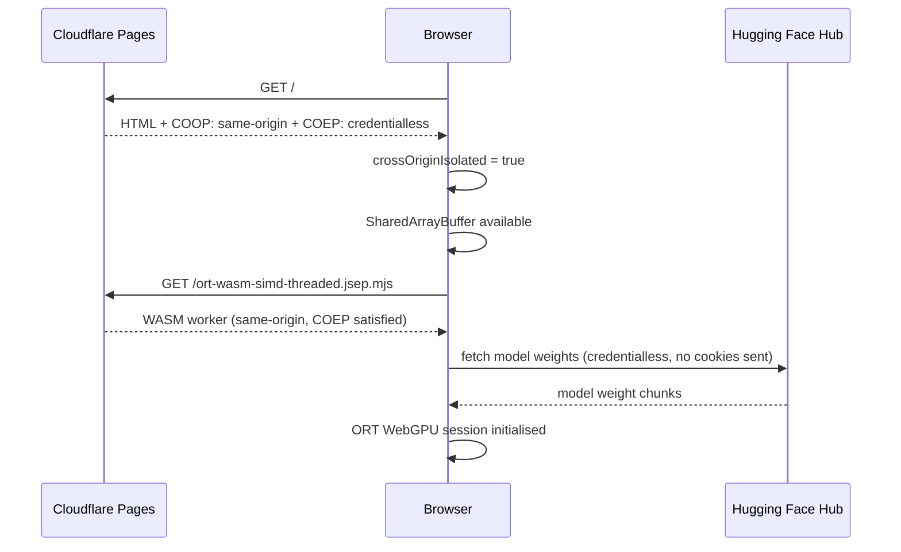

# Security model

## Cross-origin isolation

WebGPU's ONNX Runtime backend uses `SharedArrayBuffer` for zero-copy data transfer between the main thread and GPU workers. Browsers only expose `SharedArrayBuffer` when the page is cross-origin isolated — a security measure introduced after Spectre.

Cross-origin isolation requires two HTTP response headers on every document response:

```
Cross-Origin-Opener-Policy: same-origin
Cross-Origin-Embedder-Policy: credentialless
```

These are set globally in `public/_headers`, which Cloudflare Pages applies to every response served from the project.

```
/*
  Cross-Origin-Opener-Policy: same-origin
  Cross-Origin-Embedder-Policy: credentialless
```

### Why `credentialless` instead of `require-corp`

`require-corp` is the stricter COEP mode — it requires every cross-origin resource to explicitly opt in via `Cross-Origin-Resource-Policy: cross-origin`. Hugging Face Hub does not set this header on model weight responses, so `require-corp` would block model downloads entirely.

`credentialless` is a newer, more practical COEP mode: it allows cross-origin resources to load but strips credentials (cookies, auth headers) from those requests. For model weight fetches from a public CDN, this is exactly what we want.

---

## ONNX Runtime worker scripts

ONNX Runtime Web spawns `Web Workers` to run WASM computation. Under any COEP mode, worker scripts must be same-origin — the browser blocks cross-origin worker script loads.

The default behaviour of `@huggingface/transformers` is to load ORT worker scripts from `cdn.jsdelivr.net`. Under COEP, this fails with a `SecurityError`.

### Solution: same-origin ORT files

During the build, ONNX Runtime worker scripts and WASM binaries are copied from `node_modules/onnxruntime-web/dist/` into `public/`. Vite's static asset pipeline then includes them in the deployment alongside the app.

```
public/
  ort-wasm-simd-threaded.mjs           # Base WASM worker
  ort-wasm-simd-threaded.asyncify.mjs  # Asyncify variant
  ort-wasm-simd-threaded.jsep.mjs      # JSEP (WebGPU) worker
  ort-wasm-simd-threaded.asyncify.wasm # WASM binary
  ort-wasm-simd-threaded.jsep.wasm     # JSEP WASM binary
```

The runtime is then pointed at the same origin:

```typescript
// src/services/TransformersModelService.ts
;(env as any).backends.onnx.wasm.wasmPaths = '/'
```

This tells ONNX Runtime to resolve all worker scripts and WASM files relative to the page origin, hitting the files in `public/` instead of the CDN.

---

## Data privacy

No user data leaves the browser. The inference pipeline is entirely local:



The only network requests made after initial page load are:

1. **Model weight downloads** — fetched from Hugging Face Hub on first use, then served from the browser's Cache API on subsequent visits. These are reads of public model weights; no user data is sent.
2. Nothing else.

---

## WebGPU threat model

WebGPU is a sandboxed GPU API. It does not provide access to arbitrary GPU memory or other processes. Browsers implement additional isolation on top of the OS GPU driver. The API surface exposed to this application is:

- Shader compilation and execution (used by ONNX Runtime's JSEP backend)
- Buffer allocation and transfer (model weights and activation tensors)

No GPU data persists beyond the browser tab's lifetime. Closing the tab frees all GPU resources.

---

## Cross-origin isolation flow


